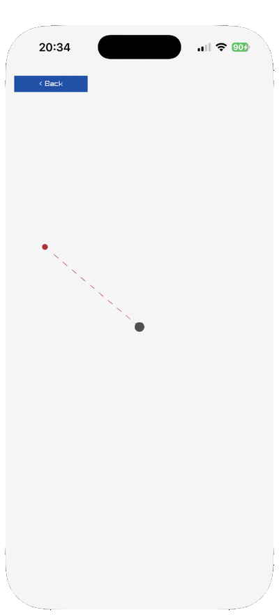

# Dashed Line

A dashed line to your finger. One of the Toys scenes in the raylib-ios gallery, and an app of its own here.



## What it is

A dashed line from the centre to your finger, ported from raylib-jolt-demo's `dashed-line` demo (originally raylib-jlt's `dashed_line`).

## Measured

| per frame | fps | notes |
| --- | ---: | --- |
| ~24 short lines | 58 | equal dashes, by walking the unit vector |

Frame rates are from an iPhone 17 Pro; the [scene catalog](../../../docs/guide/scene-catalog.md) says how they were measured.

## Build it

```sh
UDID=<hardware udid> bb dashed-line      # from the repo root: build, sign, install, launch
UDID=<hardware udid> bb run         # the same, from this directory
UDID=<hardware udid> bb live        # with an nREPL on the phone (dev build)
bb test                           # this scene's tests, no device needed
```

The app is `net.b12n.raylib-ios.scenes.dashed.app`, which hands `(scene)` to raylib-ios's single-scene runner. It carries this scene and nothing else.

## Source

- the scene, pure: `src/net/b12n/raylib_ios/scenes/dashed.cljc`
- its `draw-scene!` method: `src/net/b12n/raylib_ios/scenes/dashed/draw.clj`
- its tests: `test/net/b12n/raylib_ios/scenes/dashed_test.cljc`

## Where it comes from

Ported from raylib-jolt-demo's `dashed-line` demo (originally raylib-jlt). The licence rule: raylib-jlt was zlib before 2026-09-05 and EPL 2.0 after, and every raylib C example is zlib. `NOTICE` has this scene's entry.
