<!-- Generated by `bb gen` from demos.edn. Edits here are overwritten. -->
# Scene gallery

All 137 scenes, grouped by category: 136 sub-projects, plus Hello, which lives in raylib-ios. Each name links to the
scene's own sub-project, where its page has the description and the source.
Build one to a phone with `bb <name>`, or all of them with `bb gallery`.

## Generative (9)

### [Spirograph](https://github.com/jlt-commons/raylib-ios-demo/tree/main/spirograph)

A hypotrochoid that draws itself, then resets. Build it with `bb spirograph`.

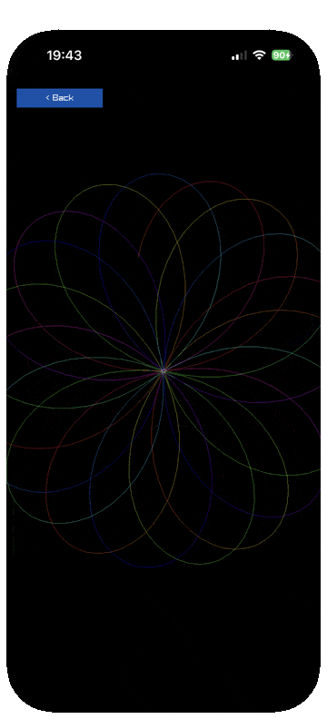

### [Kaleidoscope](https://github.com/jlt-commons/raylib-ios-demo/tree/main/kaleidoscope)

A stroke mirrored with six-fold symmetry. Build it with `bb kaleidoscope`.

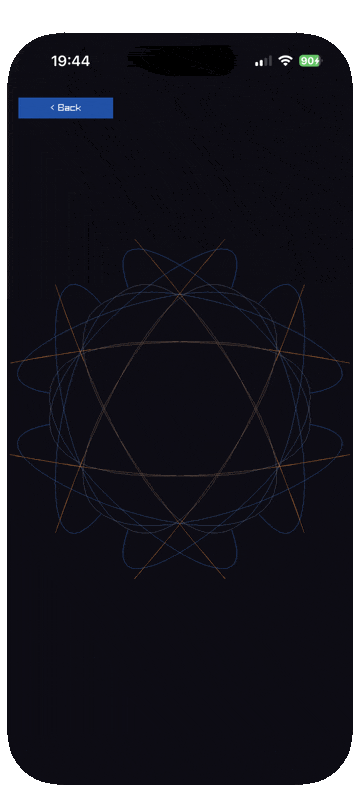

### [Fireworks](https://github.com/jlt-commons/raylib-ios-demo/tree/main/fireworks)

Rockets and fading particle bursts. Build it with `bb fireworks`.

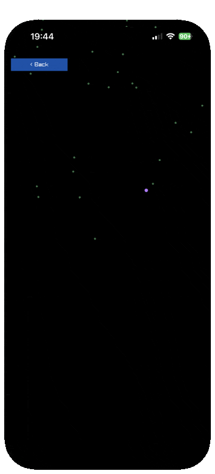

### [Penrose](https://github.com/jlt-commons/raylib-ios-demo/tree/main/penrose-tiling)

A Penrose P3 tiling made by deflation. Build it with `bb penrose-tiling`.

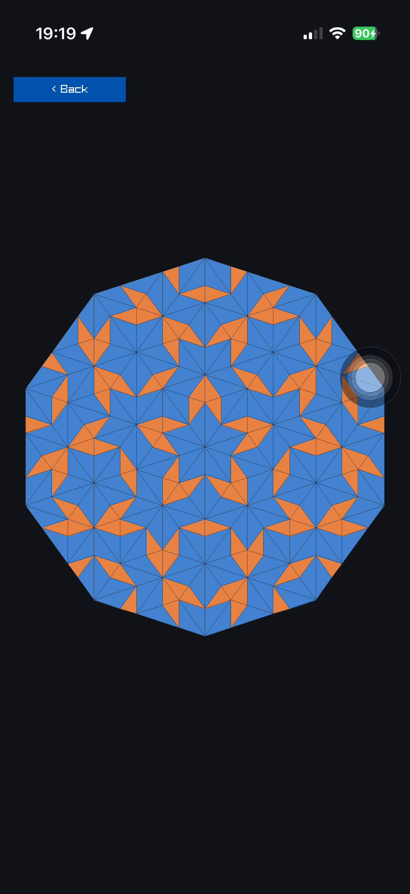

### [Fourier Epicycles](https://github.com/jlt-commons/raylib-ios-demo/tree/main/fourier-epicycles)

Circles on circles that draw a square wave. Build it with `bb fourier-epicycles`.

### [Flow Field](https://github.com/jlt-commons/raylib-ios-demo/tree/main/flow-field)

Particles steered by a flow field. Build it with `bb flow-field`.

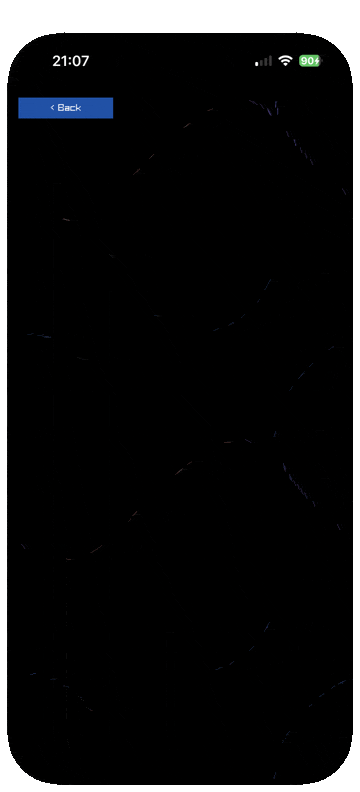

### [Lorenz](https://github.com/jlt-commons/raylib-ios-demo/tree/main/lorenz-attractor)

The Lorenz attractor, re-projected each frame. Build it with `bb lorenz-attractor`.

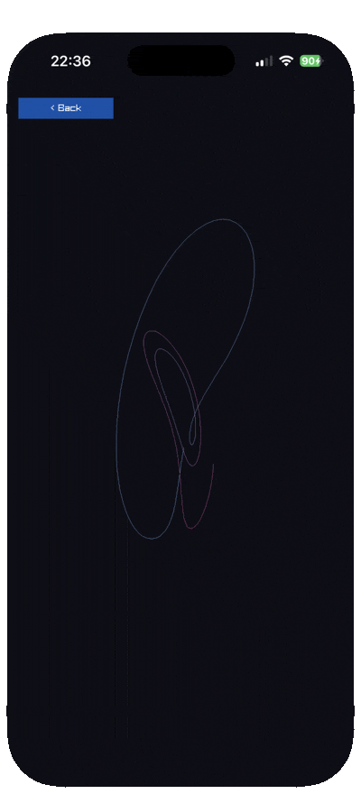

### [Life](https://github.com/jlt-commons/raylib-ios-demo/tree/main/game-of-life)

Conway's Game of Life, reseeded when it stalls. Build it with `bb game-of-life`.

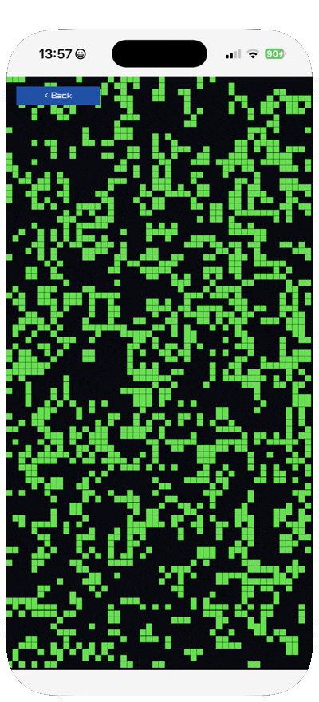

### [Bullet Spiral](https://github.com/jlt-commons/raylib-ios-demo/tree/main/bullet-hell)

A three-armed bullet spiral. Build it with `bb bullet-hell`.

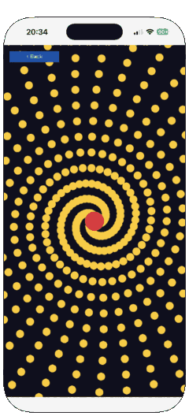

## Fractals (4)

### [Hilbert Curve](https://github.com/jlt-commons/raylib-ios-demo/tree/main/hilbert-curve)

A Hilbert curve drawn progressively. Build it with `bb hilbert-curve`.

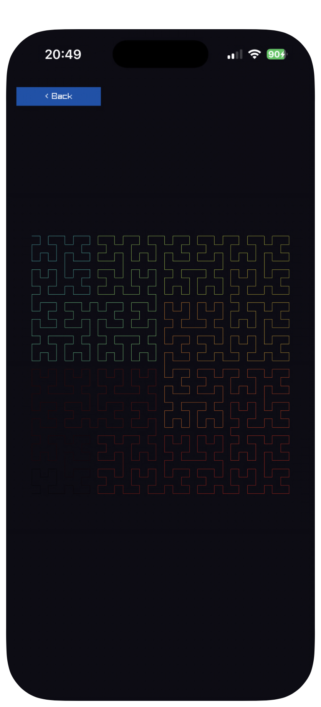

### [Fractal Tree](https://github.com/jlt-commons/raylib-ios-demo/tree/main/recursive-tree)

A binary fractal tree that sways. Build it with `bb recursive-tree`.

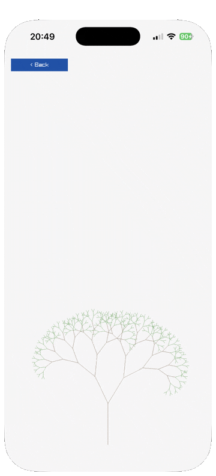

### [L-system Plant](https://github.com/jlt-commons/raylib-ios-demo/tree/main/l-system)

An L-system plant that grows and regrows. Build it with `bb l-system`.

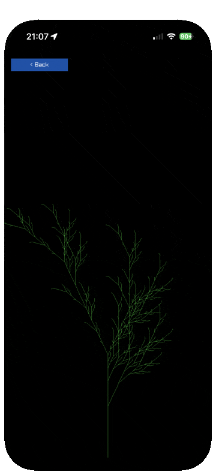

### [Automata](https://github.com/jlt-commons/raylib-ios-demo/tree/main/cellular-automata)

Elementary cellular automata, scrolling. Build it with `bb cellular-automata`.

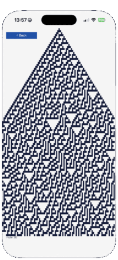

## Toys (113)

### [Following Eyes](https://github.com/jlt-commons/raylib-ios-demo/tree/main/eyes)

Two eyes that track your finger. Build it with `bb eyes`.

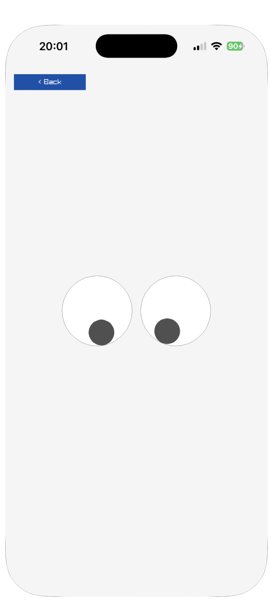

### [Touch Trail](https://github.com/jlt-commons/raylib-ios-demo/tree/main/mouse-trail)

A fading trail follows your finger. Build it with `bb mouse-trail`.

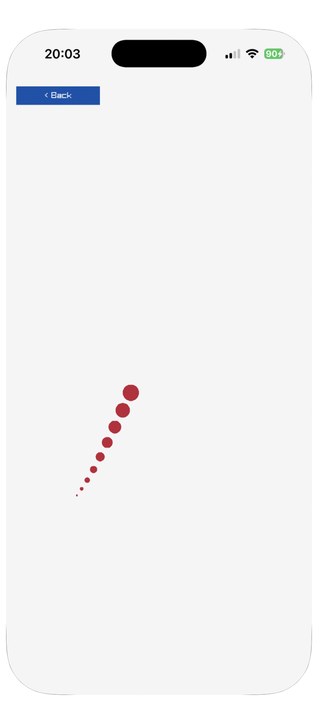

### [Boids](https://github.com/jlt-commons/raylib-ios-demo/tree/main/boids)

A flock: separation, alignment, cohesion. Build it with `bb boids`.

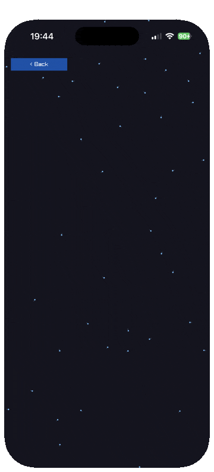

### [Double Pendulum](https://github.com/jlt-commons/raylib-ios-demo/tree/main/double-pendulum)

A chaotic double pendulum with a trail. Build it with `bb double-pendulum`.

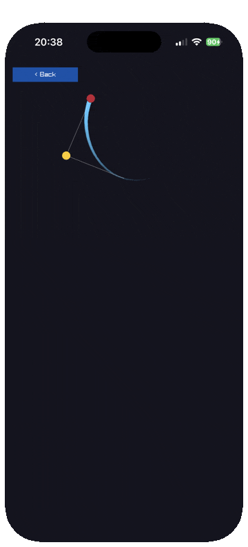

### [Starfield](https://github.com/jlt-commons/raylib-ios-demo/tree/main/stars)

A twinkling starfield. Build it with `bb stars`.

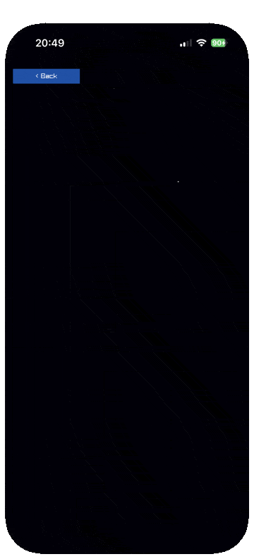

### [Tesseract](https://github.com/jlt-commons/raylib-ios-demo/tree/main/tesseract-view)

A rotating 4D hypercube. Build it with `bb tesseract-view`.

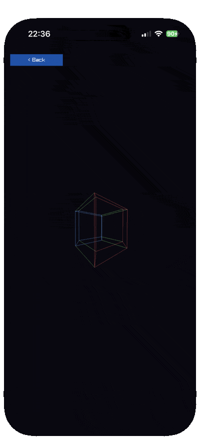

### [Colour Wheel](https://github.com/jlt-commons/raylib-ios-demo/tree/main/color-wheel)

An HSV colour wheel as an rlgl triangle fan. Build it with `bb color-wheel`.

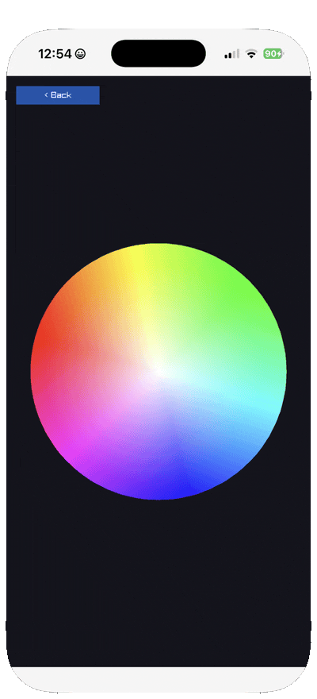

### [Sine & Cosine](https://github.com/jlt-commons/raylib-ios-demo/tree/main/math-sine-cosine)

Sine and cosine as projections of a radius. Build it with `bb math-sine-cosine`.

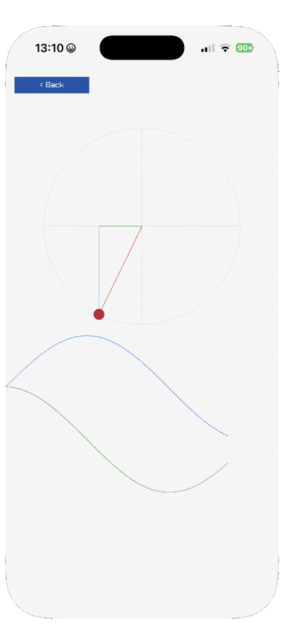

### [Clock](https://github.com/jlt-commons/raylib-ios-demo/tree/main/digital-clock)

A seven-segment clock from libc time. Build it with `bb digital-clock`.

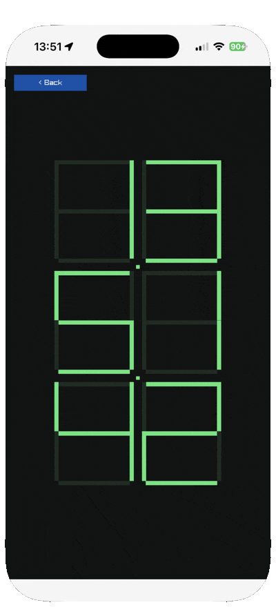

### [Pie Chart](https://github.com/jlt-commons/raylib-ios-demo/tree/main/pie-chart)

A rotating pie chart. Build it with `bb pie-chart`.

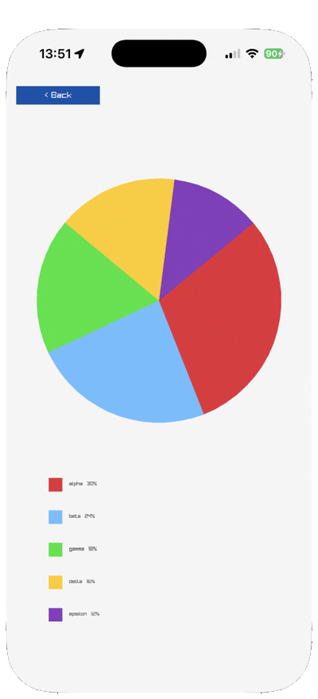

### [raylib Logo](https://github.com/jlt-commons/raylib-ios-demo/tree/main/logo-anim)

The raylib logo assembling itself. Build it with `bb logo-anim`.

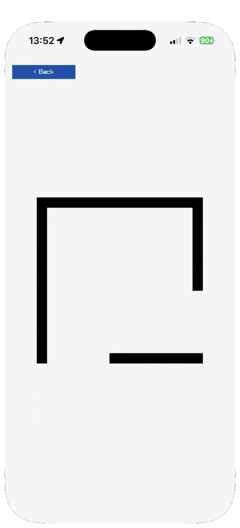

### [Easings](https://github.com/jlt-commons/raylib-ios-demo/tree/main/easings)

All fifteen easing curves on one clock. Build it with `bb easings`.

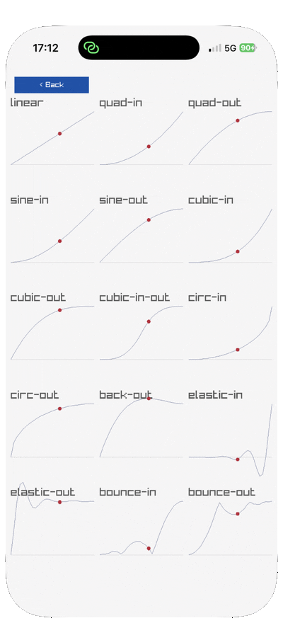

### [Angles](https://github.com/jlt-commons/raylib-ios-demo/tree/main/math-angle-rotation)

Fixed spokes and one that turns. Build it with `bb math-angle-rotation`.

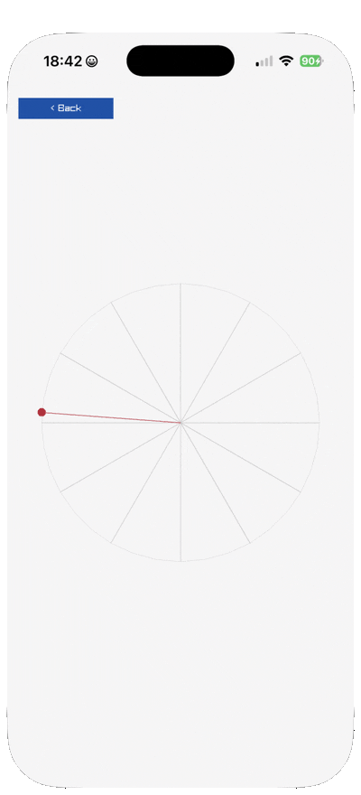

### [Writing](https://github.com/jlt-commons/raylib-ios-demo/tree/main/writing-anim)

A message that types itself out. Build it with `bb writing-anim`.

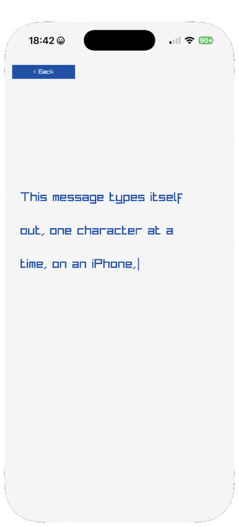

### [Ball Physics](https://github.com/jlt-commons/raylib-ios-demo/tree/main/ball-physics)

Balls under gravity. Build it with `bb ball-physics`.

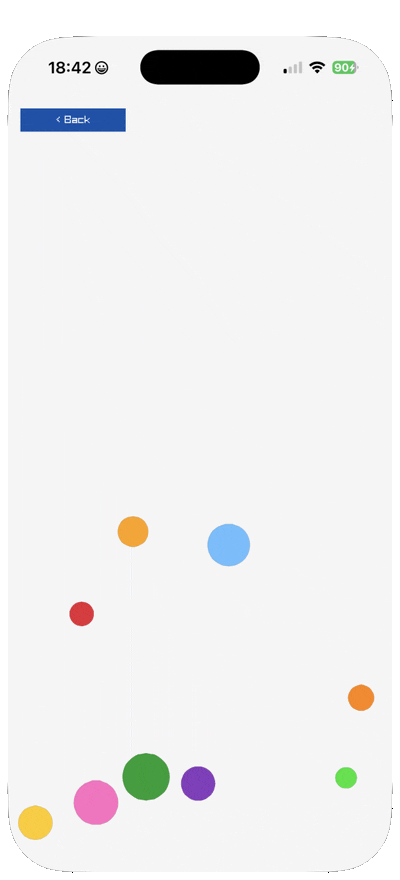

### [Random Sequence](https://github.com/jlt-commons/raylib-ios-demo/tree/main/random-sequence)

A shuffled sequence of bars. Build it with `bb random-sequence`.

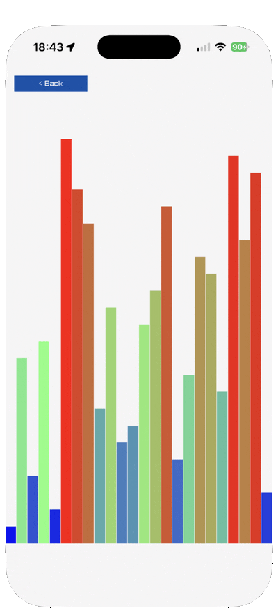

### [Collision Area](https://github.com/jlt-commons/raylib-ios-demo/tree/main/collision-area)

Two boxes and their overlap. Build it with `bb collision-area`.

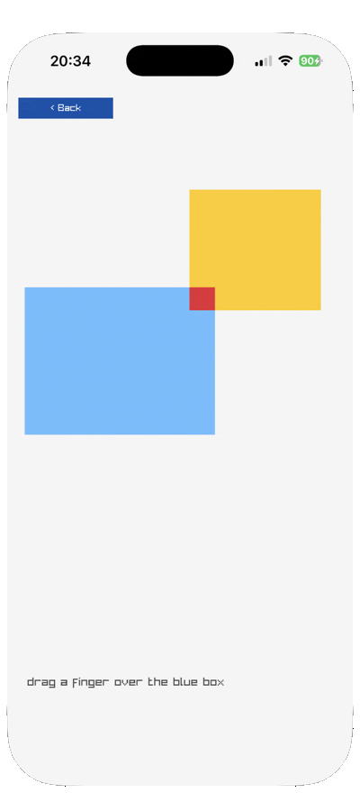

### [Dashed Line](https://github.com/jlt-commons/raylib-ios-demo/tree/main/dashed-line)

A dashed line to your finger. Build it with `bb dashed-line`.

### [Multitouch](https://github.com/jlt-commons/raylib-ios-demo/tree/main/input-multitouch)

A circle and trail for every finger. Build it with `bb input-multitouch`.

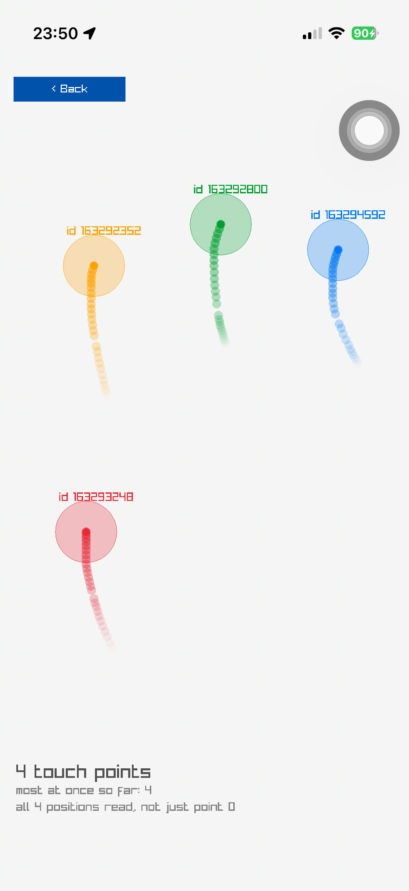

### [Analog Clock](https://github.com/jlt-commons/raylib-ios-demo/tree/main/analog-clock)

A live analog clock face. Build it with `bb analog-clock`.

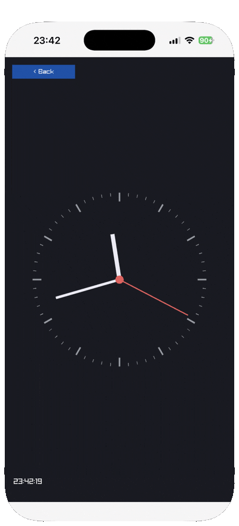

### [Clock of Clocks](https://github.com/jlt-commons/raylib-ios-demo/tree/main/clock-of-clocks)

The time spelled by a grid of tiny clocks. Build it with `bb clock-of-clocks`.

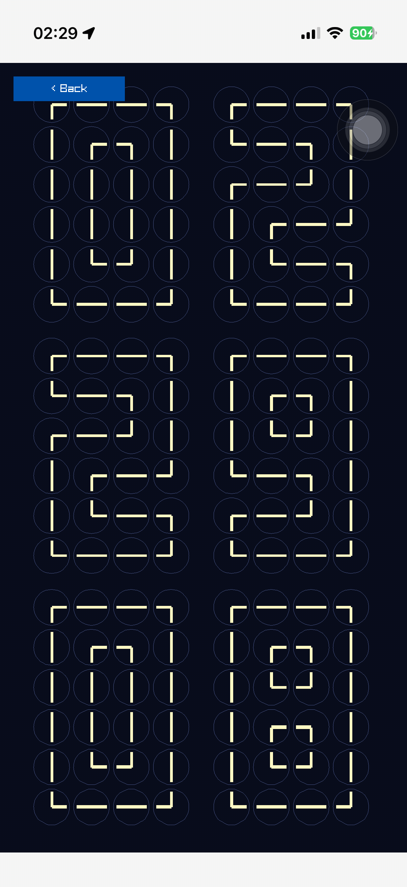

### [Circle Sector](https://github.com/jlt-commons/raylib-ios-demo/tree/main/circle-sector-drawing)

A pie slice that degrades to a triangle. Build it with `bb circle-sector-drawing`.

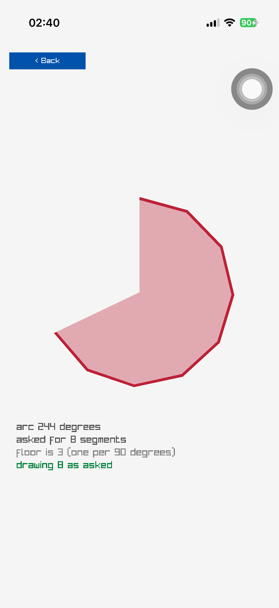

### [Colours](https://github.com/jlt-commons/raylib-ios-demo/tree/main/colors)

Every colour raylib names, as a grid. Build it with `bb colors`.

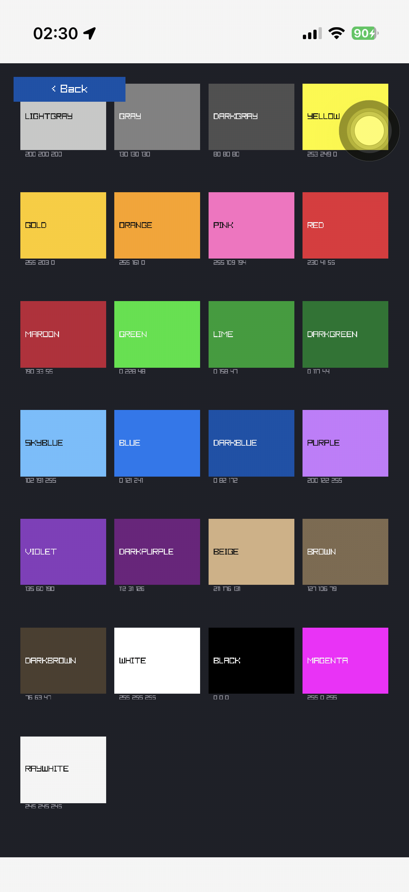

### [Gradients](https://github.com/jlt-commons/raylib-ios-demo/tree/main/gradient)

Colour interpolated across a rectangle. Build it with `bb gradient`.

### [Ring Drawing](https://github.com/jlt-commons/raylib-ios-demo/tree/main/ring-drawing)

A breathing annulus with a stroked outline. Build it with `bb ring-drawing`.

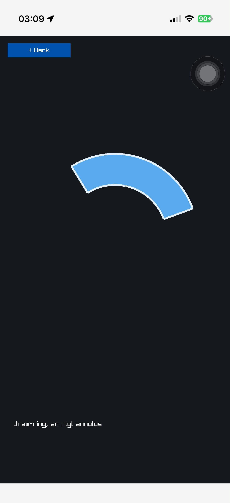

### [Splines](https://github.com/jlt-commons/raylib-ios-demo/tree/main/splines)

Three spline bases over five points. Build it with `bb splines`.

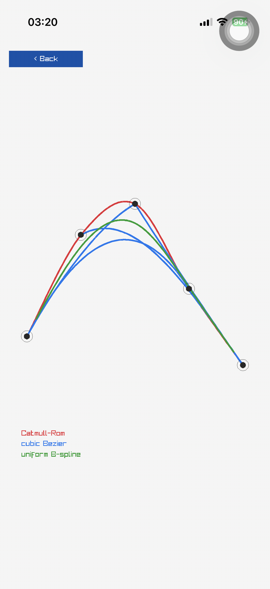

### [Rounded Rect](https://github.com/jlt-commons/raylib-ios-demo/tree/main/rounded-rectangle)

A rectangle breathing from square to round. Build it with `bb rounded-rectangle`.

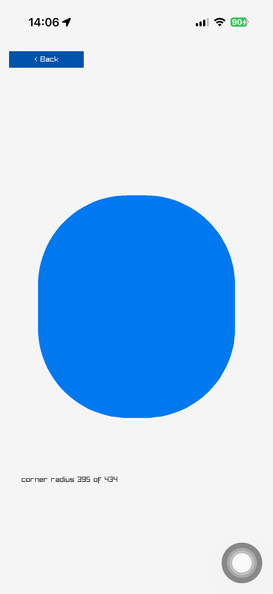

### [Vector Angle](https://github.com/jlt-commons/raylib-ios-demo/tree/main/vector-angle)

The signed angle between two vectors. Build it with `bb vector-angle`.

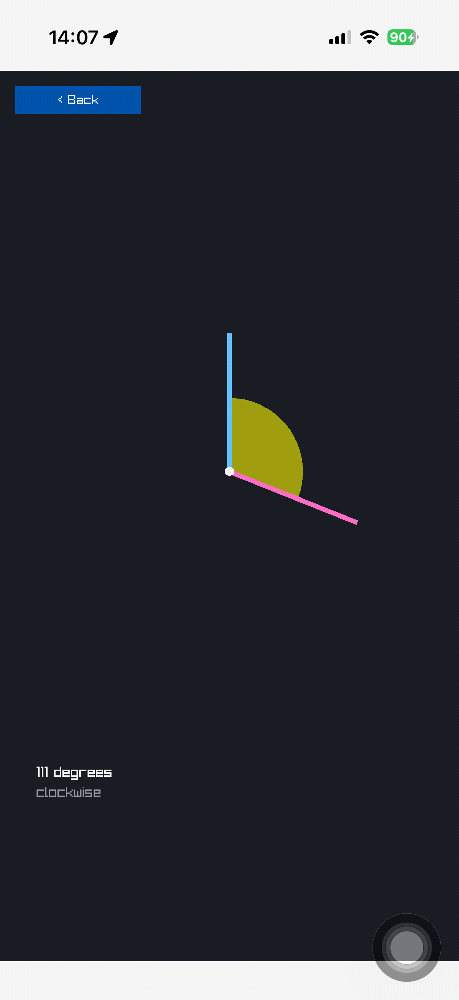

### [Rounded Bars](https://github.com/jlt-commons/raylib-ios-demo/tree/main/rectangle-advanced)

Per-side rounded bars with a gradient. Build it with `bb rectangle-advanced`.

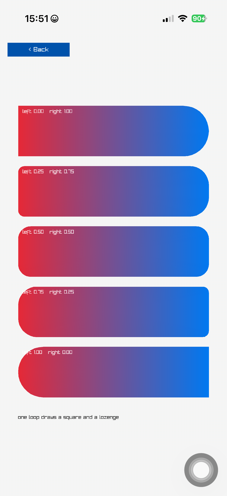

### [Bezier](https://github.com/jlt-commons/raylib-ios-demo/tree/main/lines-bezier)

A cubic Bezier that follows your finger. Build it with `bb lines-bezier`.

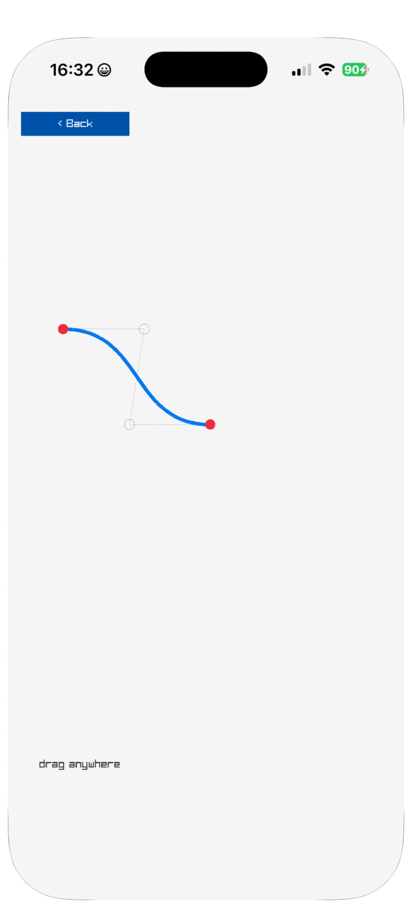

### [Line Widths](https://github.com/jlt-commons/raylib-ios-demo/tree/main/lines-drawing)

A turning fan of thick lines. Build it with `bb lines-drawing`.

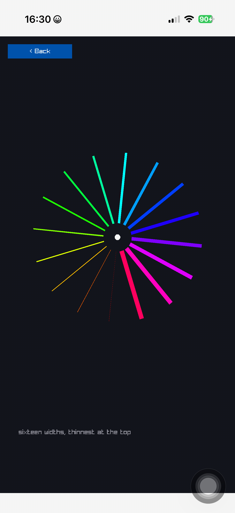

### [Scissor](https://github.com/jlt-commons/raylib-ios-demo/tree/main/scissor-test)

A moving scissor box clips a grid. Build it with `bb scissor-test`.

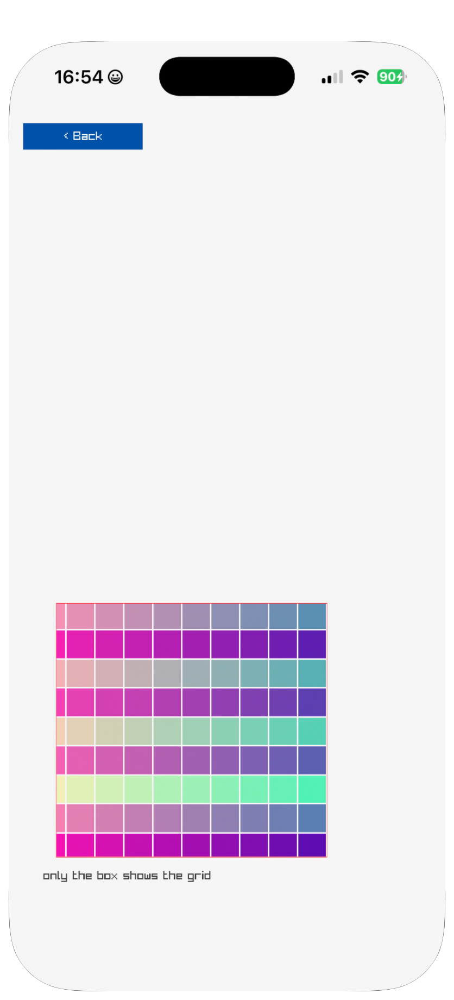

### [Resize](https://github.com/jlt-commons/raylib-ios-demo/tree/main/rectangle-scaling)

Drag a corner handle to resize a rectangle. Build it with `bb rectangle-scaling`.

### [Text Alignment](https://github.com/jlt-commons/raylib-ios-demo/tree/main/words-alignment)

A word aligned left, centre and right. Build it with `bb words-alignment`.

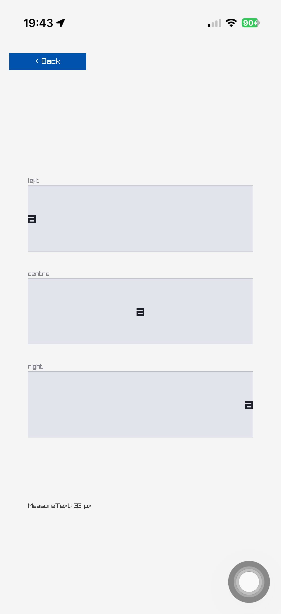

### [Delta Time](https://github.com/jlt-commons/raylib-ios-demo/tree/main/delta-time)

Per-frame against delta-time movement. Build it with `bb delta-time`.

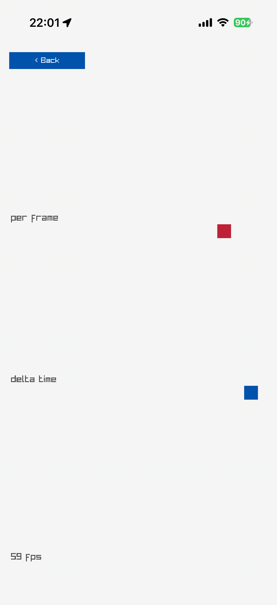

### [Random Values](https://github.com/jlt-commons/raylib-ios-demo/tree/main/random-values)

A new random number every two seconds. Build it with `bb random-values`.

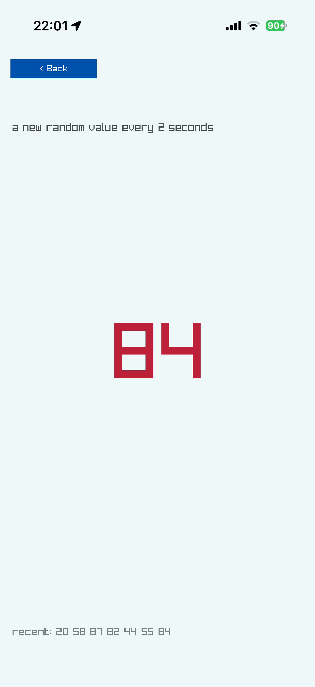

### [Formatted Text](https://github.com/jlt-commons/raylib-ios-demo/tree/main/format-text)

A padded score and an MM:SS timer. Build it with `bb format-text`.

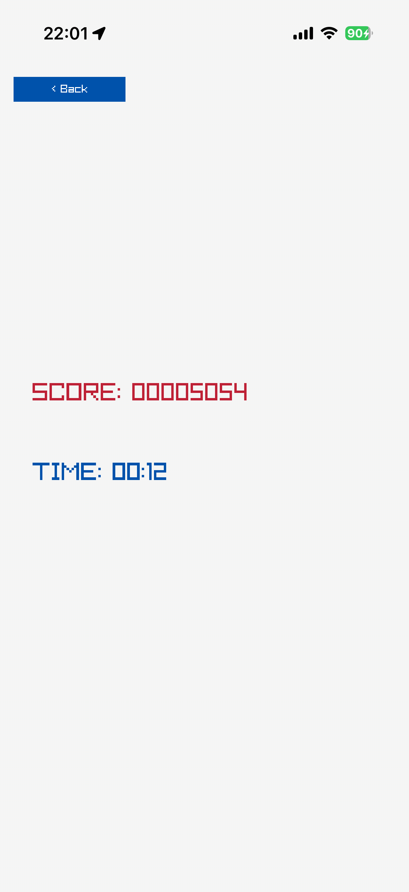

### [Triangle Strip](https://github.com/jlt-commons/raylib-ios-demo/tree/main/triangle-strip)

A rainbow triangle strip. Build it with `bb triangle-strip`.

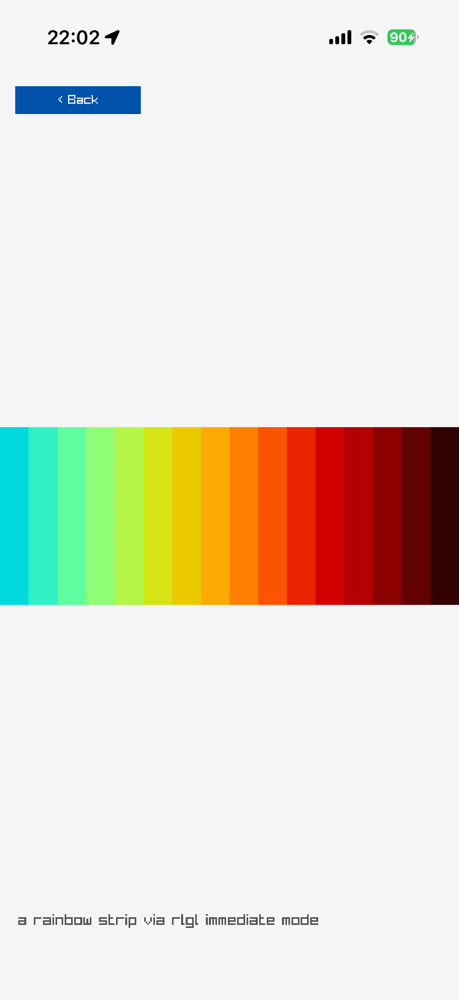

### [Touch Ball](https://github.com/jlt-commons/raylib-ios-demo/tree/main/mouse)

A ball that follows your finger. Build it with `bb mouse`.

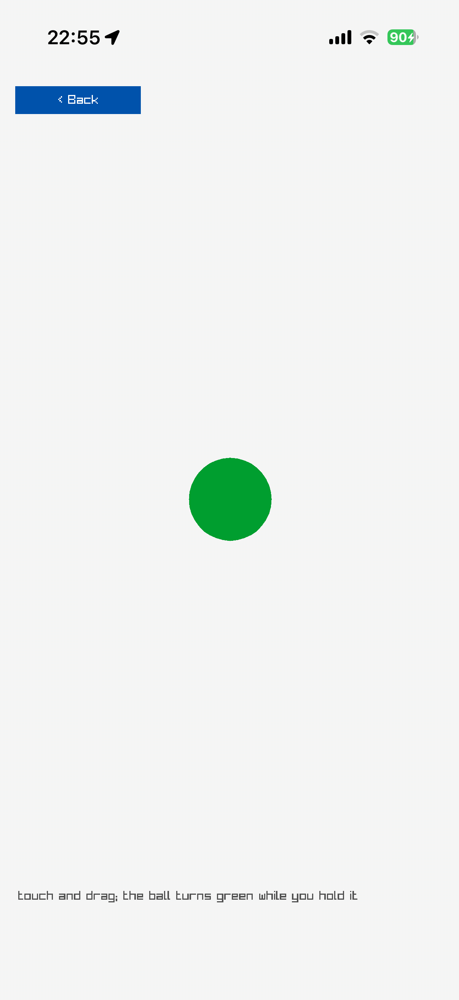

### [rlgl Triangle](https://github.com/jlt-commons/raylib-ios-demo/tree/main/rlgl-triangle)

A Gouraud triangle with draggable corners. Build it with `bb rlgl-triangle`.

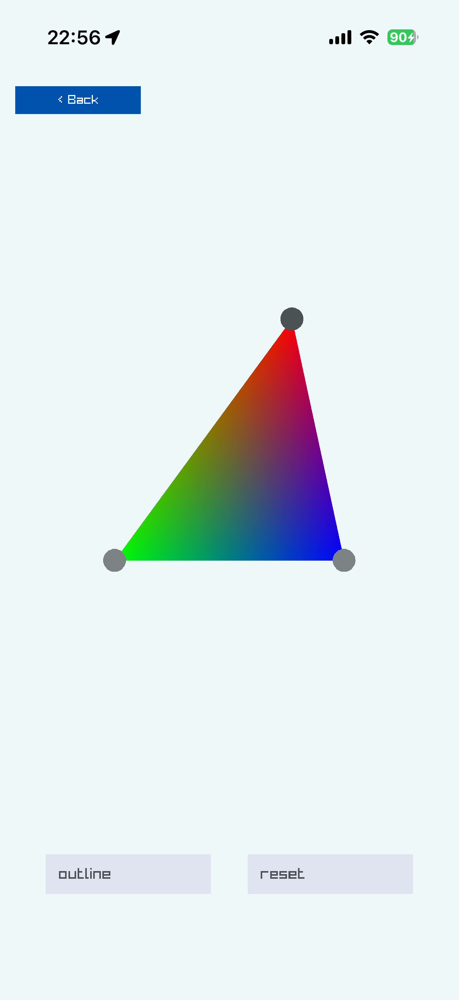

### [Particles](https://github.com/jlt-commons/raylib-ios-demo/tree/main/particles)

Water, smoke and fire from your fingertip. Build it with `bb particles`.

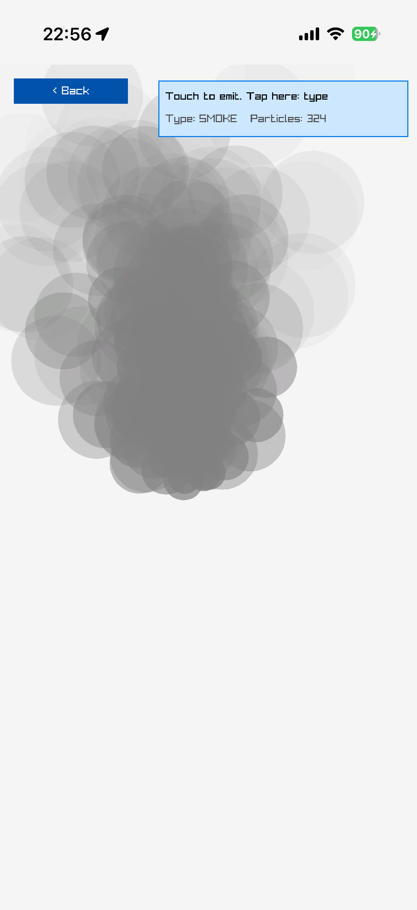

### [Bouncing Ball](https://github.com/jlt-commons/raylib-ios-demo/tree/main/bounce)

A bouncing ball; tap to pause. Build it with `bb bounce`.

### [Virtual Controls](https://github.com/jlt-commons/raylib-ios-demo/tree/main/input-virtual-controls)

An on-screen D-pad and action button. Build it with `bb input-virtual-controls`.

### [Starfield Effect](https://github.com/jlt-commons/raylib-ios-demo/tree/main/starfield-effect)

Stars flying at you, dragged faster or slower. Build it with `bb starfield-effect`.

### [Easings Box](https://github.com/jlt-commons/raylib-ios-demo/tree/main/easings-box)

Drop, flatten, spin, grow and fade a square. Build it with `bb easings-box`.

### [Easings Testbed](https://github.com/jlt-commons/raylib-ios-demo/tree/main/easings-testbed)

One easing curve at a time, plotted. Build it with `bb easings-testbed`.

### [Rectangle Bounds](https://github.com/jlt-commons/raylib-ios-demo/tree/main/rectangle-bounds)

Word-wrapped text in a resizable box. Build it with `bb rectangle-bounds`.

### [rlgl Hue Wheel](https://github.com/jlt-commons/raylib-ios-demo/tree/main/rlgl-color-wheel)

A hue wheel with a colour on every vertex. Build it with `bb rlgl-color-wheel`.

### [Still Logo](https://github.com/jlt-commons/raylib-ios-demo/tree/main/logo)

The raylib logo, still. Build it with `bb logo`.

### [Font Sizes](https://github.com/jlt-commons/raylib-ios-demo/tree/main/text)

Lines at several sizes and colours. Build it with `bb text`.

### [Inline Styling](https://github.com/jlt-commons/raylib-ios-demo/tree/main/inline-styling)

Colours set inside the string itself. Build it with `bb inline-styling`.

### [Outline Thickness](https://github.com/jlt-commons/raylib-ios-demo/tree/main/outlines-thickness)

Three outlines driven by one thickness. Build it with `bb outlines-thickness`.

### [Basic Shapes](https://github.com/jlt-commons/raylib-ios-demo/tree/main/shapes)

A static tour of the basic shapes. Build it with `bb shapes`.

### [Ellipse Collision](https://github.com/jlt-commons/raylib-ios-demo/tree/main/ellipse-collision)

Two ellipses that redden when they overlap. Build it with `bb ellipse-collision`.

### [Screen Manager](https://github.com/jlt-commons/raylib-ios-demo/tree/main/basic-screen-manager)

A LOGO, TITLE, GAMEPLAY, ENDING flow. Build it with `bb basic-screen-manager`.

### Basic Window (in raylib-ios)

The basic window: one line of text. It is raylib-ios's own proof scene, so it has no sub-project here.

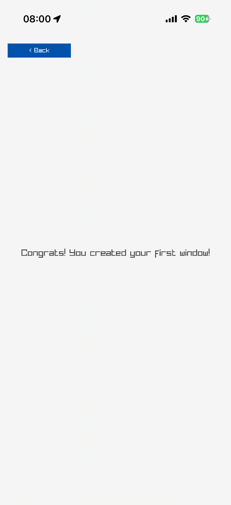

### [Keyboard Ball](https://github.com/jlt-commons/raylib-ios-demo/tree/main/input)

A ball moved with a thumb-stick. Build it with `bb input`.

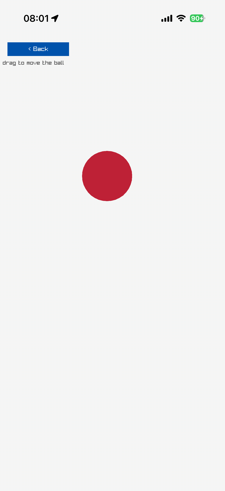

### [Mouse Wheel](https://github.com/jlt-commons/raylib-ios-demo/tree/main/wheel)

A box dragged up and down. Build it with `bb wheel`.

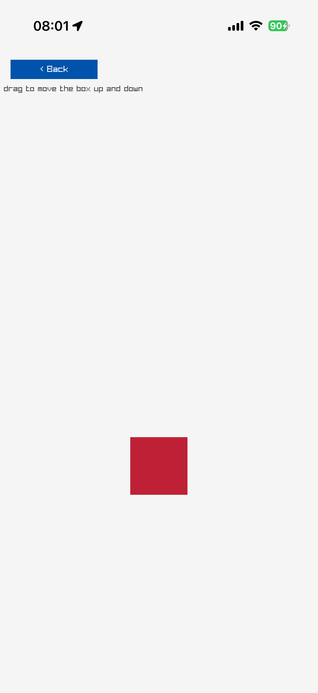

### [Undo Redo](https://github.com/jlt-commons/raylib-ios-demo/tree/main/undo-redo)

A square on a grid with bounded undo. Build it with `bb undo-redo`.

### [Strings Management](https://github.com/jlt-commons/raylib-ios-demo/tree/main/strings-management)

Text particles you throw, cut and glue. Build it with `bb strings-management`.

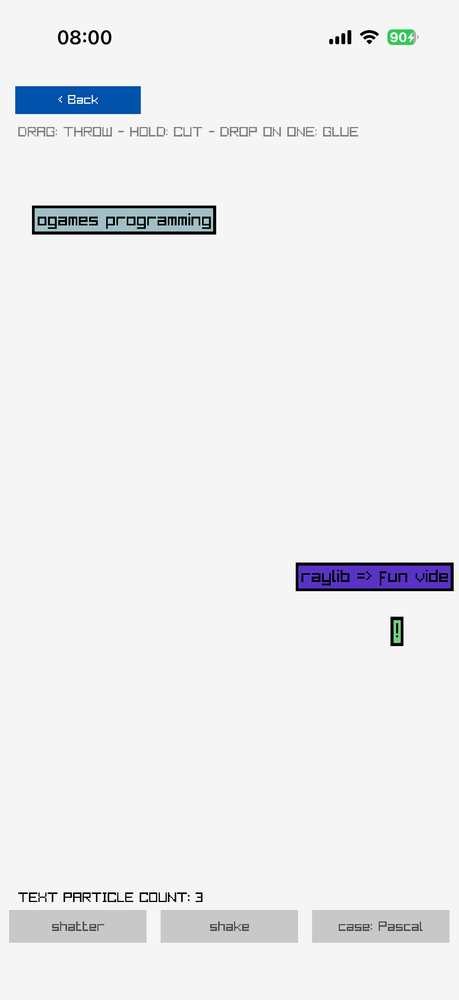

### [2D Camera](https://github.com/jlt-commons/raylib-ios-demo/tree/main/camera2d)

A 2D camera following a player on a skyline. Build it with `bb camera2d`.

### [2D Camera Zoom](https://github.com/jlt-commons/raylib-ios-demo/tree/main/camera-2d-mouse-zoom)

A 2D camera zooming about a pinned point. Build it with `bb camera-2d-mouse-zoom`.

### [2D Platformer](https://github.com/jlt-commons/raylib-ios-demo/tree/main/camera-2d-platformer)

Five ways for a camera to follow a player. Build it with `bb camera-2d-platformer`.

### [2D Split Screen](https://github.com/jlt-commons/raylib-ios-demo/tree/main/camera-2d-split-screen)

Two players on one grid in split screen. Build it with `bb camera-2d-split-screen`.

### [Input Gestures](https://github.com/jlt-commons/raylib-ios-demo/tree/main/input-gestures)

Raylib's gesture recogniser, named and logged. Build it with `bb input-gestures`.

### [Helitorus](https://github.com/jlt-commons/raylib-ios-demo/tree/main/helitorus)

A helix wound around a torus. Build it with `bb helitorus`.

### [Rotating Cube](https://github.com/jlt-commons/raylib-ios-demo/tree/main/rotating-cube)

A cube turning in place. Build it with `bb rotating-cube`.

### [3D Camera](https://github.com/jlt-commons/raylib-ios-demo/tree/main/camera-3d)

An orbiting 3D camera. Build it with `bb camera-3d`.

### [Orthographic Projection](https://github.com/jlt-commons/raylib-ios-demo/tree/main/orthographic-projection)

Perspective against orthographic projection. Build it with `bb orthographic-projection`.

### [Spinning Cubes](https://github.com/jlt-commons/raylib-ios-demo/tree/main/spinning-cubes)

A row of cubes spinning with a phase offset. Build it with `bb spinning-cubes`.

### [World to Screen](https://github.com/jlt-commons/raylib-ios-demo/tree/main/world-screen)

A 2D label pinned above a 3D cube. Build it with `bb world-screen`.

### [Wireframe Shapes](https://github.com/jlt-commons/raylib-ios-demo/tree/main/wireframe-shapes)

Four wireframe solids tumbling. Build it with `bb wireframe-shapes`.

### [3D Free Camera](https://github.com/jlt-commons/raylib-ios-demo/tree/main/camera-3d-free)

A free 3D camera on two thumbs. Build it with `bb camera-3d-free`.

### [Yaw Pitch Roll](https://github.com/jlt-commons/raylib-ios-demo/tree/main/yaw-pitch-roll)

A plane flown with three aircraft rotations. Build it with `bb yaw-pitch-roll`.

### [Box Collisions](https://github.com/jlt-commons/raylib-ios-demo/tree/main/box-collisions)

A cube walked across a grid of boxes. Build it with `bb box-collisions`.

### [3D Picking](https://github.com/jlt-commons/raylib-ios-demo/tree/main/picking-3d)

Tap a cube to pick it with a ray. Build it with `bb picking-3d`.

### [Waving Cubes](https://github.com/jlt-commons/raylib-ios-demo/tree/main/waving-cubes)

A grid of columns rippling like water. Build it with `bb waving-cubes`.

### [Solar System](https://github.com/jlt-commons/raylib-ios-demo/tree/main/rlgl-solar-system)

A sun, Earth and Moon through nested transforms. Build it with `bb rlgl-solar-system`.

### [Point Cloud](https://github.com/jlt-commons/raylib-ios-demo/tree/main/point-cloud)

A cloud of points turning slowly. Build it with `bb point-cloud`.

### [First-Person Camera](https://github.com/jlt-commons/raylib-ios-demo/tree/main/camera-3d-first-person)

A first-person walk round a yard of columns. Build it with `bb camera-3d-first-person`.

### [First-Person Maze](https://github.com/jlt-commons/raylib-ios-demo/tree/main/first-person-maze)

A first-person maze with a minimap. Build it with `bb first-person-maze`.

### [3D Split Screen](https://github.com/jlt-commons/raylib-ios-demo/tree/main/camera-3d-split-screen)

Two players, two cameras, half a screen each. Build it with `bb camera-3d-split-screen`.

### [Bouncing Spheres](https://github.com/jlt-commons/raylib-ios-demo/tree/main/bouncing-spheres)

Six balls bouncing in a box. Build it with `bb bouncing-spheres`.

### [Bunnymark](https://github.com/jlt-commons/raylib-ios-demo/tree/main/bunnymark)

The sprite-count benchmark. Build it with `bb bunnymark`.

### [Background Scrolling](https://github.com/jlt-commons/raylib-ios-demo/tree/main/background-scrolling)

Three parallax skyline layers. Build it with `bb background-scrolling`.

### [Sprite Stacking](https://github.com/jlt-commons/raylib-ios-demo/tree/main/sprite-stacking)

Forty slices faking a 3D car. Build it with `bb sprite-stacking`.

### [Smooth Pixel-Perfect](https://github.com/jlt-commons/raylib-ios-demo/tree/main/smooth-pixelperfect)

A smooth pixel-perfect camera. Build it with `bb smooth-pixelperfect`.

### [Viewport Scaling](https://github.com/jlt-commons/raylib-ios-demo/tree/main/viewport-scaling)

Six viewport scaling policies. Build it with `bb viewport-scaling`.

### [Window Letterbox](https://github.com/jlt-commons/raylib-ios-demo/tree/main/window-letterbox)

A fixed picture letterboxed to any shape. Build it with `bb window-letterbox`.

### [Fog of War](https://github.com/jlt-commons/raylib-ios-demo/tree/main/fog-of-war)

A tile map under a fog that lifts as you walk. Build it with `bb fog-of-war`.

### [Blend Modes](https://github.com/jlt-commons/raylib-ios-demo/tree/main/blend-modes)

Blend modes over a night skyline. Build it with `bb blend-modes`.

### [Particles Blending](https://github.com/jlt-commons/raylib-ios-demo/tree/main/particles-blending)

200 sparks, alpha against additive. Build it with `bb particles-blending`.

### [Billboard Rendering](https://github.com/jlt-commons/raylib-ios-demo/tree/main/billboard-rendering)

Camera-facing billboards over a grid. Build it with `bb billboard-rendering`.

### [Directional Billboard](https://github.com/jlt-commons/raylib-ios-demo/tree/main/directional-billboard)

A walking billboard figure seen from all sides. Build it with `bb directional-billboard`.

### [Textured Cube](https://github.com/jlt-commons/raylib-ios-demo/tree/main/textured-cube)

Two textured cubes under an orbiting camera. Build it with `bb textured-cube`.

### [Geometric Shapes](https://github.com/jlt-commons/raylib-ios-demo/tree/main/geometric-shapes)

Cubes, a sphere, cylinders, a cone, a capsule. Build it with `bb geometric-shapes`.

### [Basic Voxel](https://github.com/jlt-commons/raylib-ios-demo/tree/main/basic-voxel)

A voxel block you walk round and hollow out. Build it with `bb basic-voxel`.

### [Doom-like Raycaster](https://github.com/jlt-commons/raylib-ios-demo/tree/main/doom)

A Doom-style ray caster on two thumbs. Build it with `bb doom`.

### [Texture Tiling](https://github.com/jlt-commons/raylib-ios-demo/tree/main/texture-tiling)

One tile repeated across the screen. Build it with `bb texture-tiling`.

### [Srcrec Dstrec](https://github.com/jlt-commons/raylib-ios-demo/tree/main/srcrec-dstrec)

A source rectangle picks the frame, a dest scales. Build it with `bb srcrec-dstrec`.

### [Sprite Button](https://github.com/jlt-commons/raylib-ios-demo/tree/main/sprite-button)

One sheet, three button states. Build it with `bb sprite-button`.

### [Npatch Drawing](https://github.com/jlt-commons/raylib-ios-demo/tree/main/npatch-drawing)

Nine-patch stretching with fixed corners. Build it with `bb npatch-drawing`.

### [Polygon Drawing](https://github.com/jlt-commons/raylib-ios-demo/tree/main/polygon-drawing)

A hue-wheel texture on a polygon. Build it with `bb polygon-drawing`.

### [Procedural Textures](https://github.com/jlt-commons/raylib-ios-demo/tree/main/texture-procedural)

Four procedural textures. Build it with `bb texture-procedural`.

### [Sprite Animation](https://github.com/jlt-commons/raylib-ios-demo/tree/main/sprite-animation)

Six poses cycled from one source rectangle. Build it with `bb sprite-animation`.

### [Textured Curve](https://github.com/jlt-commons/raylib-ios-demo/tree/main/textured-curve)

A road texture laid along a Bezier curve. Build it with `bb textured-curve`.

### [Render Texture](https://github.com/jlt-commons/raylib-ios-demo/tree/main/render-texture)

A scene drawn off-screen, then reused. Build it with `bb render-texture`.

### [Framebuffer Rendering](https://github.com/jlt-commons/raylib-ios-demo/tree/main/framebuffer-rendering)

Two cameras into two framebuffers. Build it with `bb framebuffer-rendering`.

### [Mouse Painting](https://github.com/jlt-commons/raylib-ios-demo/tree/main/mouse-painting)

A paint program on a render-target canvas. Build it with `bb mouse-painting`.

### [Magnifying Glass](https://github.com/jlt-commons/raylib-ios-demo/tree/main/magnifying-glass)

A lens that magnifies what it covers. Build it with `bb magnifying-glass`.

### [Top Down Lights](https://github.com/jlt-commons/raylib-ios-demo/tree/main/top-down-lights)

Lights and shadow volumes from a top-down view. Build it with `bb top-down-lights`.

### [Raw Data](https://github.com/jlt-commons/raylib-ios-demo/tree/main/raw-data)

Textures built from a hand-filled byte buffer. Build it with `bb raw-data`.

### [Screen Buffer](https://github.com/jlt-commons/raylib-ios-demo/tree/main/screen-buffer)

The classic DOS fire effect. Build it with `bb screen-buffer`.

## Games (11)

### [Flappy Bird](https://github.com/jlt-commons/raylib-ios-demo/tree/main/flappy-bird)

Tap to flap through the pipe gaps. Build it with `bb flappy-bird`.

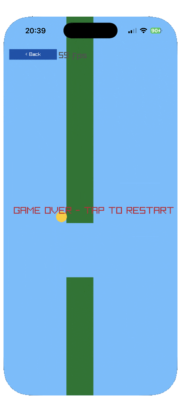

### [Breakout](https://github.com/jlt-commons/raylib-ios-demo/tree/main/breakout)

Paddle, ball and bricks. Build it with `bb breakout`.

### [Snake](https://github.com/jlt-commons/raylib-ios-demo/tree/main/snake)

The classic snake, steered by swipes. Build it with `bb snake`.

### [2048](https://github.com/jlt-commons/raylib-ios-demo/tree/main/game-2048)

2048, played by swipe. Build it with `bb game-2048`.

### [Minesweeper](https://github.com/jlt-commons/raylib-ios-demo/tree/main/minesweeper)

Tap to reveal, long press to flag. Build it with `bb minesweeper`.

### [Pong](https://github.com/jlt-commons/raylib-ios-demo/tree/main/pong)

Pong against a CPU, paddle on a finger. Build it with `bb pong`.

### [Space Invaders](https://github.com/jlt-commons/raylib-ios-demo/tree/main/space-invaders)

Marching aliens and a one-finger ship. Build it with `bb space-invaders`.

### [Tetris](https://github.com/jlt-commons/raylib-ios-demo/tree/main/tetris)

The block-stacking puzzle by drag and tap. Build it with `bb tetris`.

### [Asteroids](https://github.com/jlt-commons/raylib-ios-demo/tree/main/asteroids)

The vector shooter on four buttons. Build it with `bb asteroids`.

### [Vampire Survivors](https://github.com/jlt-commons/raylib-ios-demo/tree/main/vampire-survivors)

Auto-fire survival with a thumb-stick. Build it with `bb vampire-survivors`.

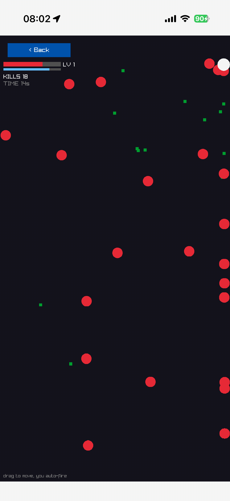

### [Pac-Man](https://github.com/jlt-commons/raylib-ios-demo/tree/main/pacman)

Pac-Man, steered by swipes. Build it with `bb pacman`.

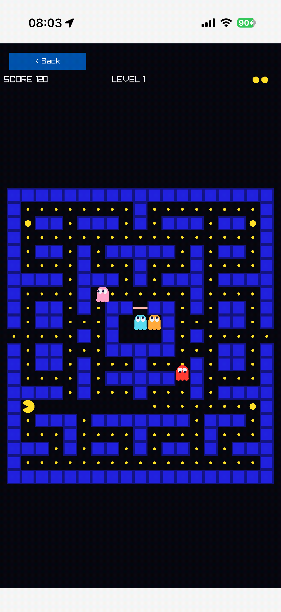
