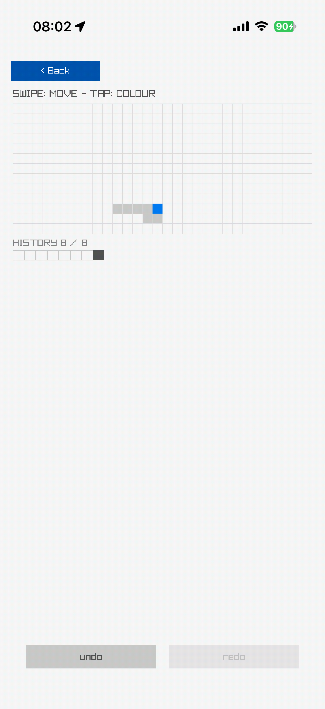

# Undo Redo

A square on a grid with bounded undo. One of the Toys scenes in the raylib-ios gallery, and an app of its own here.



## What it is

A square driven round a grid with a bounded undo history. Ported from raylib-jolt-demo's `undo-redo` demo (originally raylib-jlt's `undo-redo`), which is raylib's `core_undo_redo` example.

## Measured

| per frame | fps | notes |
| --- | ---: | --- |
| 1 line of text, up to 26 trail squares, 45 grid lines, 1 square, 1 line of text for the history, up to 26 history slots and 2 labelled buttons | 58 | a swipe moves the square one cell in place of the arrow keys, a tap on the square or the field recolours it in place of SPACE, and two buttons along the bottom replace CTRL-Z and CTRL-Y; the grid is the original's 30 by 13 and is not turned with the screen, the history holds the original's 26 states with redo cleared by a new action, and it is sampled every second frame as the original does; the history count sits above its strip instead of beside it, the grid lines are thicker so they show on a phone, and a button greys out when it has nothing to do; a touch under Back is ignored |

Frame rates are from an iPhone 17 Pro; the [scene catalog](../../../docs/guide/scene-catalog.md) says how they were measured.

## Build it

```sh
UDID=<hardware udid> bb undo-redo      # from the repo root: build, sign, install, launch
UDID=<hardware udid> bb run         # the same, from this directory
UDID=<hardware udid> bb live        # with an nREPL on the phone (dev build)
bb test                           # this scene's tests, no device needed
```

The app is `net.b12n.raylib-ios.scenes.undoredo.app`, which hands `(scene)` to raylib-ios's single-scene runner. It carries this scene and nothing else.

## Source

- the scene, pure: `src/net/b12n/raylib_ios/scenes/undoredo.cljc`
- its `draw-scene!` method: `src/net/b12n/raylib_ios/scenes/undoredo/draw.clj`
- its tests: `test/net/b12n/raylib_ios/scenes/undoredo_test.cljc`

## Where it comes from

Ported from raylib-jolt-demo's `undo-redo` demo (originally raylib-jlt). The licence rule: raylib-jlt was zlib before 2026-09-05 and EPL 2.0 after, and every raylib C example is zlib. `NOTICE` has this scene's entry.
